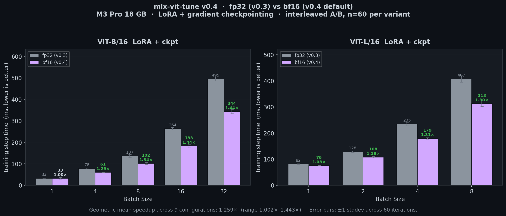
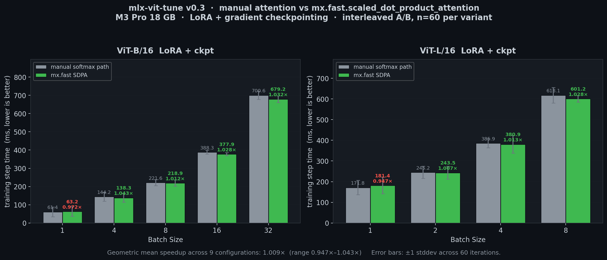

# mlx-vit-tune

Fine-tune Vision Transformers on Apple Silicon with MLX. LoRA and full fine-tuning with an Unsloth-like API.

From the creator of [LoRA-ViT](https://github.com/JamesQFreeman/LoRA-ViT) — now natively on Mac.

## Why

- No MLX ViT fine-tuning pipeline exists
- Apple Silicon's unified memory lets you fine-tune ViT-B/L/H locally
- Gradient checkpointing makes LoRA 2x faster and uses 80% less memory
- Supports both LoRA and full fine-tuning

## Benchmark

Historical tables (Full FT, peak memory, ViT-L) are **v0.2** on **Apple M4 16GB, fp32**.
The **ViT-B LoRA table below** shows the current **v0.4** release (bf16 + fused SDPA
+ gradient checkpointing) on **Apple M3 Pro 18GB**.


### ViT-B/16 LoRA Training (img/s)

| Batch | CPU | MLX | mlx-vit-tune v0.4 | Total speedup |
|:---:|:---:|:---:|:---:|:---:|
| 1 | 4.5 | 11.9 | **30.6** | **6.8x** |
| 4 | 8.2 | 16.6 | **65.8** | **8.0x** |
| 8 | 8.0 | 17.2 | **78.3** | **9.8x** |
| 16 | 8.5 | 17.5 | **87.6** | **10.3x** |
| 32 | — | 17.6 | **93.1** | — |

> **CPU** = PyTorch CPU, M4 16GB (v0.1 baseline). **MLX** = vanilla MLX fp32
> on M4 16GB, no optimizations. **mlx-vit-tune v0.4** = M3 Pro 18GB with
> bf16 + `mx.fast.scaled_dot_product_attention` + gradient checkpointing.
> The speedup column combines the M4→M3 Pro hardware upgrade with the
> v0.1→v0.4 software optimizations. See the Version History section for
> the software-only delta on the same hardware.

### ViT-B/16 Full Fine-Tuning (img/s)

| Batch | MLX | mlx-vit-tune | Peak Memory |
|:---:|:---:|:---:|:---:|
| 1 | 5.8 | 5.4 | 1.9 GB |
| 8 | 14.4 | 14.0 | 1.9 GB |
| 16 | 15.3 | 15.3 | 1.9 GB |
| 32 | 15.8 | **15.9** | **2.8 GB** |

> Full FT speed is similar with or without checkpointing, but memory drops dramatically at large batches (8.3 GB &rarr; 2.9 GB at batch 32).

### Peak Memory (MB) — LoRA

| Batch | MLX | mlx-vit-tune | Saved |
|:---:|:---:|:---:|:---:|
| 1 | 573 | **372** | 35% |
| 4 | 1,256 | **451** | 64% |
| 8 | 2,165 | **557** | 74% |
| 16 | 3,982 | **768** | 81% |
| 32 | 7,615 | **1,190** | 84% |

### ViT-L/16 LoRA — Now Trainable on 16GB

| Batch | MLX (img/s) | mlx-vit-tune (img/s) | MLX Peak | mlx-vit-tune Peak |
|:---:|:---:|:---:|:---:|:---:|
| 1 | 4.2 | **8.3** | 1,756 MB | **1,241 MB** |
| 2 | 5.1 | **10.5** | 2,311 MB | **1,269 MB** |
| 4 | 5.5 | **11.6** | 3,419 MB | **1,339 MB** |
| 8 | 5.6 | **12.4** | 5,639 MB | **1,479 MB** |

ViT-L with 304M parameters trains comfortably at batch 8, using under 1.5 GB peak memory with gradient checkpointing.

## Quick Start

```bash
pip install mlx numpy pillow safetensors huggingface_hub tqdm pyyaml
```

```python
from mlx_vit import FastViTModel
from mlx_vit.data import ImageDataset
from mlx_vit.trainer import TrainingArgs, train

# Load a ViT with gradient checkpointing (2x faster LoRA, 80% less memory)
model = FastViTModel.from_pretrained(
    "vit_base_patch16_224", num_classes=10,
    gradient_checkpointing=True,
)

# LoRA fine-tuning — targets ALL linear layers (Q,K,V,O,fc1,fc2)
model = FastViTModel.get_lora_model(model, rank=8)

# Or skip LoRA for full fine-tuning — just train directly
# model = FastViTModel.from_pretrained("vit_base_patch16_224", num_classes=10)

# Train
train_ds = ImageDataset("data/train", image_size=224, augment=True)
val_ds = ImageDataset("data/val", image_size=224, augment=False)

train(model, train_ds, val_ds, TrainingArgs(
    batch_size=8, lr=1e-4, epochs=10
))
```

## Demo

Run the self-contained demo — no downloads needed:

```bash
python scripts/demo.py
```

Creates a synthetic 2-class dataset, fine-tunes ViT-B/16 with LoRA, and saves the adapters.

## Supported Architectures

| Architecture | Params | Config |
|-------------|--------|--------|
| **ViT-B/16** | 86M | 12 layers, 768 dim, 12 heads |
| **ViT-L/16** | 304M | 24 layers, 1024 dim, 16 heads |
| **ViT-H/14** | 632M | 32 layers, 1280 dim, 16 heads |
| **ViT-H/14 + SwiGLU** | 632-681M | SwiGLU FFN + register tokens |

## LoRA: Target ALL Layers

Research shows ViT LoRA must target **all linear layers**, not just attention.
MLP layers contain ~2/3 of ViT parameters — attention-only LoRA significantly underperforms.

```python
# Default: targets Q, K, V, output proj, MLP fc1, MLP fc2
model = FastViTModel.get_lora_model(model, rank=8, target_modules="all")

# Or be specific
model = FastViTModel.get_lora_model(model, rank=8, target_modules="attention")  # Q,K,V,O only
model = FastViTModel.get_lora_model(model, rank=8, target_modules="mlp")        # fc1,fc2 only
```

## Loading Pretrained Models

```python
# Random weights (for testing)
model = FastViTModel.from_pretrained("vit_base_patch16_224", num_classes=10)

# From HuggingFace (auto-downloads and converts to MLX)
model = FastViTModel.from_pretrained("owkin/phikon", num_classes=5, hf_token="hf_xxx")

# From local converted weights
model = FastViTModel.from_pretrained("/path/to/weights", num_classes=5)
```

## Dataset Format

Directory structure (ImageFolder style):
```
data/
  train/
    cats/
      img001.png
    dogs/
      img002.png
  val/
    cats/
      img003.png
    dogs/
      img004.png
```

Also supports CSV (`image_path,label`) and JSON formats.

## CLI

```bash
python scripts/train.py \
    --model vit_base_patch16_224 \
    --train_data data/train \
    --val_data data/val \
    --num_classes 10 \
    --lora --lora_rank 8 \
    --batch_size 8 --lr 1e-4 --epochs 10
```

## Saving and Loading

```python
# Save LoRA adapters
FastViTModel.save_pretrained(model, "my_adapters")

# Save merged model (LoRA baked into weights)
FastViTModel.save_pretrained_merged(model, "my_merged_model")

# Load adapters onto a base model
base = FastViTModel.from_pretrained("vit_base_patch16_224", num_classes=10)
model = FastViTModel.load_adapters(base, "my_adapters")
```

## Version History

### v0.4 — bfloat16 by default



`ViTConfig.dtype` defaults to `mx.bfloat16`. bf16 has fp32's 8-bit exponent
range (no overflow NaN even with random init) and 7 mantissa bits — enough
for ViT fine-tuning and matching the training recipes of Qwen2-VL / UNI2-h /
SigLIP / DINOv2. On Apple Silicon the reduced-precision path is real:
M3 Pro peaks at 3.57 TFLOPs fp32 vs 5.14 TFLOPs bf16 on a 4096² square, a
1.44× delta. (Whether this is "native bf16 silicon" or MLX riding the fp16
ALU with a bf16 dtype wrapper isn't publicly documented — the [Arnaud
et al. 2025 HPC benchmark](https://arxiv.org/abs/2502.05317) lists only
fp32/fp16/int8 as natively supported on the M-series GPU. Either way the
wall-clock win is measurable end-to-end.)

Measured on M3 Pro 18 GB, interleaved A/B, n=60 per variant, LoRA + grad ckpt:

- **Geometric mean speedup: 1.259×** across 9 configurations
- Compute-bound configs (ViT-B bs ≥ 16) hit the **1.44× hardware ceiling**
- **Memory halved** — weights, activations, optimizer state all drop to 16 bits
- bf16 output differs from fp32 by ~1.25% relative; 10-step bf16 LoRA training
  converges from loss 1.85 → 0.04 with no NaN (regression tested)

Recover exact v0.3 behavior with `ViTConfig(dtype=mx.float32)` or
`FastViTModel.from_pretrained(..., dtype="float32")`.

### v0.3 — Fused attention via `mx.fast.scaled_dot_product_attention`



The `Attention` module routes through MLX's native fused Metal SDPA kernel
instead of the manual `Q @ K.T → softmax → @V` chain. Bitwise-identical
to the reference path (0.00e+00 max diff on forward, loss, and gradients)
but dispatches fewer Metal calls and fuses the softmax.

Measured on M3 Pro 18 GB, interleaved A/B, n=60 per variant:

- Geometric mean speedup: **1.009×** (range 0.947× – 1.043×)
- Consistent positive at batch ≥ 4; slightly slower at batch 1 where kernel
  fixed cost dominates (not a realistic training regime)

The SDPA win is small because ViT has no causal mask to skip, no large-vocab
cross-entropy, and no RoPE — the three tricks that dominate Unsloth's LLM
speedup. On this shape, MLP is 54% of per-block time and already at peak
matmul utilization. Ships primarily as a correctness-preserving foundation
for more aggressive v0.5+ attention fusions.

### v0.2.1 — M3 Pro 18GB benchmarks + multi-chip comparison


Added a full v0.2 benchmark sweep on M3 Pro 18GB. The M3 Pro's wider GPU
(14 cores vs 10) and faster memory bus (150 GB/s vs 120 GB/s) deliver a
consistent **1.5–1.6× speedup** per configuration. The extra 2 GB of unified
memory also lets ViT-L Full FT run at batch 8 without thrashing — on M4 it
collapses to 0.1 img/s, on M3 Pro it stays clean at 6.8 img/s.

### v0.2 — Gradient checkpointing + memory reporting

`mx.checkpoint` wraps every transformer block, cutting activation memory at
the cost of ~33% extra forward compute. ViT-L LoRA becomes trainable on
16 GB (batch 1–2 without ckpt, batch 8 with). Gradient accumulation and
memory reporting utilities land at the same time.

### v0.1 — Initial release

ViT-B / ViT-L / ViT-H with optional SwiGLU + register tokens (UNI2-h,
Virchow2 architectures), LoRA with all-linear-layer targeting (not just
attention — MLP layers hold ~2/3 of ViT params), HuggingFace weight
conversion, AdamW training loop with cosine / linear / constant LR
schedules, and the `FastViTModel` Unsloth-style API.

## What's Next

mlx-vit-tune is a **training** tool. The next step is **deployment** —
getting the fine-tuned model off MLX and onto the rest of the Apple
Silicon ML stack (Core ML + ANE) so it can run as a shipped artifact
instead of staying trapped in a Python process.

**v0.5 — Core ML export.** One-line API (`FastViTModel.to_coreml(model, path)`)
that merges any LoRA adapters, rebuilds the architecture as a `timm`
reference model, loads the trained MLX weights into it, traces with
`torch.jit.trace`, and emits a `.mlpackage` via `coremltools.convert` —
suitable for `compute_units=ALL` so Core ML routes parts to the Apple
Neural Engine. Merging LoRA is the right default: Core ML has no concept
of runtime adapter patching, and a merged model is numerically identical
to the LoRA forward pass while landing on the ANE cleanly.

**v0.6 — Inference benchmarks on the ANE.** Measure real img/s and
energy-per-inference on ViT-B, ViT-L, and a pathology foundation model
(CONCH or UNI) for each Core ML compute-unit setting (`CPU_ONLY`,
`CPU_AND_GPU`, `ALL`) so we can see where the ANE actually wins on this
workload vs where it falls back to the GPU.

## Related Projects

- [LoRA-ViT](https://github.com/JamesQFreeman/LoRA-ViT) — LoRA for ViT in PyTorch (by the same author)
- [mlx-tune](https://github.com/ARahim3/mlx-tune) — LLM fine-tuning on MLX (API design inspiration)
- [Unsloth](https://github.com/unslothai/unsloth) — Fast LLM fine-tuning (optimization roadmap inspiration)

## License

Apache-2.0
