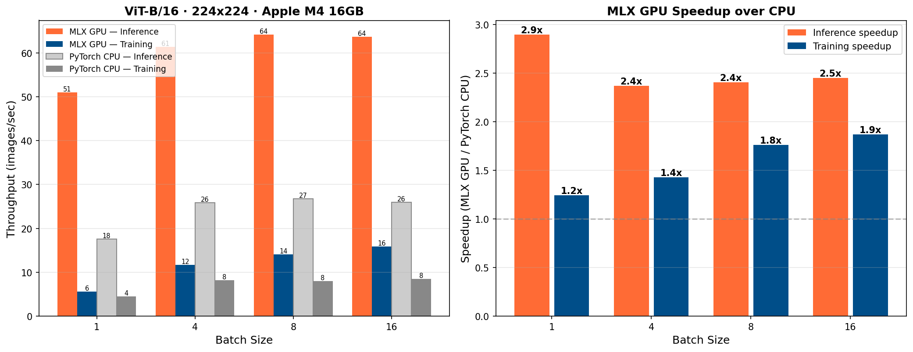

# mlx-vit-tune

Fine-tune Vision Transformers on Apple Silicon with MLX. An Unsloth-like API for ViT.

From the creator of [LoRA-ViT](https://github.com/JamesQFreeman/LoRA-ViT) — now natively on Mac.

## Why

- No MLX ViT fine-tuning pipeline exists
- Apple Silicon's unified memory lets you fine-tune ViT-B/L/H locally
- 2-3x faster than PyTorch CPU on the same hardware

## Benchmark

**ViT-B/16 · 224x224 · Apple M4 16GB · float32**



| Batch Size | MLX GPU Inference | MLX GPU Training | PyTorch CPU Inference | PyTorch CPU Training |
|:---:|:---:|:---:|:---:|:---:|
| 1 | 51 img/s | 5.6 img/s | 18 img/s | 4.5 img/s |
| 4 | 61 img/s | 12 img/s | 26 img/s | 8.2 img/s |
| 8 | 64 img/s | 14 img/s | 27 img/s | 8.0 img/s |
| 16 | 64 img/s | 16 img/s | 26 img/s | 8.5 img/s |

MLX GPU delivers **2-3x inference** and **up to 1.9x training speedup** over PyTorch CPU on the same chip. Training speedup grows with batch size as the GPU becomes better utilized.

## Quick Start

```bash
pip install mlx numpy pillow safetensors huggingface_hub tqdm pyyaml
```

```python
from mlx_vit import FastViTModel
from mlx_vit.data import ImageDataset
from mlx_vit.trainer import TrainingArgs, train

# Load a ViT
model = FastViTModel.from_pretrained("vit_base_patch16_224", num_classes=10)

# Add LoRA — targets ALL linear layers (Q,K,V,O,fc1,fc2)
model = FastViTModel.get_lora_model(model, rank=8)

# Train
train_ds = ImageDataset("data/train", image_size=224, augment=True)
val_ds = ImageDataset("data/val", image_size=224, augment=False)

train(model, train_ds, val_ds, TrainingArgs(
    batch_size=8, lr=1e-4, epochs=10
))
```

## Demo

Run the self-contained demo — no downloads needed:

```bash
python scripts/demo.py
```

Creates a synthetic 2-class dataset, fine-tunes ViT-B/16 with LoRA, and saves the adapters.

## Supported Architectures

| Architecture | Params | Config |
|-------------|--------|--------|
| **ViT-B/16** | 86M | 12 layers, 768 dim, 12 heads |
| **ViT-L/16** | 304M | 24 layers, 1024 dim, 16 heads |
| **ViT-H/14** | 632M | 32 layers, 1280 dim, 16 heads |
| **ViT-H/14 + SwiGLU** | 632-681M | SwiGLU FFN + register tokens |

## LoRA: Target ALL Layers

Research shows ViT LoRA must target **all linear layers**, not just attention.
MLP layers contain ~2/3 of ViT parameters — attention-only LoRA significantly underperforms.

```python
# Default: targets Q, K, V, output proj, MLP fc1, MLP fc2
model = FastViTModel.get_lora_model(model, rank=8, target_modules="all")

# Or be specific
model = FastViTModel.get_lora_model(model, rank=8, target_modules="attention")  # Q,K,V,O only
model = FastViTModel.get_lora_model(model, rank=8, target_modules="mlp")        # fc1,fc2 only
```

## Loading Pretrained Models

```python
# Random weights (for testing)
model = FastViTModel.from_pretrained("vit_base_patch16_224", num_classes=10)

# From HuggingFace (auto-downloads and converts to MLX)
model = FastViTModel.from_pretrained("owkin/phikon", num_classes=5, hf_token="hf_xxx")

# From local converted weights
model = FastViTModel.from_pretrained("/path/to/weights", num_classes=5)
```

## Dataset Format

Directory structure (ImageFolder style):
```
data/
  train/
    cats/
      img001.png
    dogs/
      img002.png
  val/
    cats/
      img003.png
    dogs/
      img004.png
```

Also supports CSV (`image_path,label`) and JSON formats.

## CLI

```bash
python scripts/train.py \
    --model vit_base_patch16_224 \
    --train_data data/train \
    --val_data data/val \
    --num_classes 10 \
    --lora --lora_rank 8 \
    --batch_size 8 --lr 1e-4 --epochs 10
```

## Saving and Loading

```python
# Save LoRA adapters
FastViTModel.save_pretrained(model, "my_adapters")

# Save merged model (LoRA baked into weights)
FastViTModel.save_pretrained_merged(model, "my_merged_model")

# Load adapters onto a base model
base = FastViTModel.from_pretrained("vit_base_patch16_224", num_classes=10)
model = FastViTModel.load_adapters(base, "my_adapters")
```

## Roadmap

- [x] **v0.1** — ViT-B/L/H + LoRA + training pipeline
- [ ] **v0.2** — Gradient checkpointing + accumulation
- [ ] **v0.3** — Fused LoRA autograd (Unsloth-style ~1.5-2x speedup)
- [ ] **v0.4** — Multi-resolution + evaluation (linear probe, kNN)
- [ ] **v0.5** — Big model validation on M-series Pro/Max chips
- [ ] **v0.6** — QLoRA, DoRA, AdaLoRA
- [ ] **v0.7** — Model zoo, docs, PyPI

## Related Projects

- [LoRA-ViT](https://github.com/JamesQFreeman/LoRA-ViT) — LoRA for ViT in PyTorch (by the same author)
- [mlx-tune](https://github.com/ARahim3/mlx-tune) — LLM fine-tuning on MLX (API design inspiration)
- [Unsloth](https://github.com/unslothai/unsloth) — Fast LLM fine-tuning (optimization roadmap inspiration)

## License

Apache-2.0
