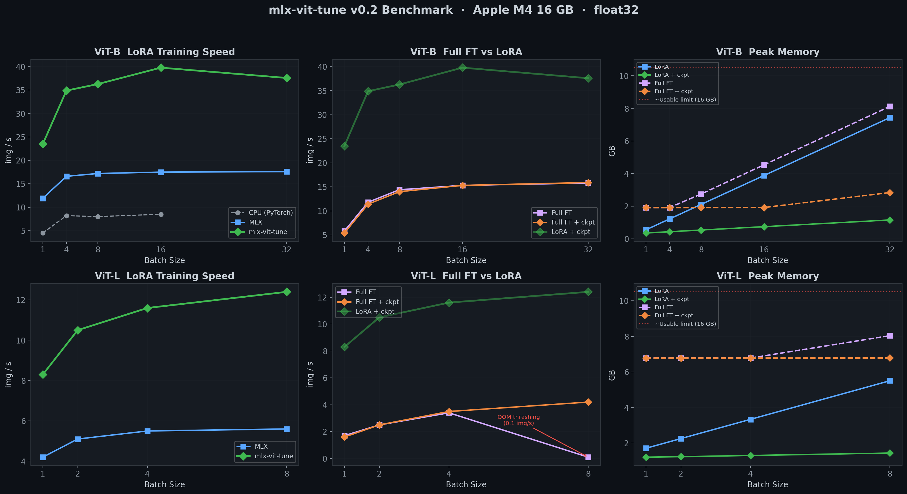
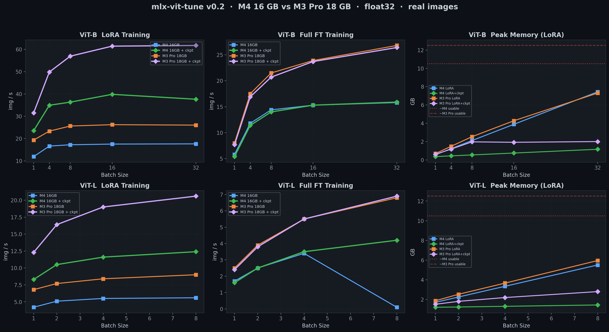

# mlx-vit-tune

Fine-tune Vision Transformers on Apple Silicon with MLX. LoRA and full fine-tuning with an Unsloth-like API.

From the creator of [LoRA-ViT](https://github.com/JamesQFreeman/LoRA-ViT) — now natively on Mac.

## Why

- No MLX ViT fine-tuning pipeline exists
- Apple Silicon's unified memory lets you fine-tune ViT-B/L/H locally
- Gradient checkpointing makes LoRA 2x faster and uses 80% less memory
- Supports both LoRA and full fine-tuning

## Benchmark

ViT-B and ViT-L tables below measured on **Apple M4 16GB, float32**. A
multi-chip comparison vs **Apple M3 Pro 18GB** follows.



### ViT-B/16 LoRA Training (img/s)

| Batch | CPU | MLX | mlx-vit-tune | Speedup vs CPU |
|:---:|:---:|:---:|:---:|:---:|
| 1 | 4.5 | 11.9 | **23.5** | **5.2x** |
| 4 | 8.2 | 16.6 | **34.9** | **4.3x** |
| 8 | 8.0 | 17.2 | **36.3** | **4.5x** |
| 16 | 8.5 | 17.5 | **39.8** | **4.7x** |
| 32 | — | 17.6 | **37.6** | — |

> **CPU** = PyTorch on CPU. **MLX** = vanilla MLX, no checkpointing. **mlx-vit-tune** = MLX + gradient checkpointing.

### ViT-B/16 Full Fine-Tuning (img/s)

| Batch | MLX | mlx-vit-tune | Peak Memory |
|:---:|:---:|:---:|:---:|
| 1 | 5.8 | 5.4 | 1.9 GB |
| 8 | 14.4 | 14.0 | 1.9 GB |
| 16 | 15.3 | 15.3 | 1.9 GB |
| 32 | 15.8 | **15.9** | **2.8 GB** |

> Full FT speed is similar with or without checkpointing, but memory drops dramatically at large batches (8.3 GB &rarr; 2.9 GB at batch 32).

### Peak Memory (MB) — LoRA

| Batch | MLX | mlx-vit-tune | Saved |
|:---:|:---:|:---:|:---:|
| 1 | 573 | **372** | 35% |
| 4 | 1,256 | **451** | 64% |
| 8 | 2,165 | **557** | 74% |
| 16 | 3,982 | **768** | 81% |
| 32 | 7,615 | **1,190** | 84% |

### ViT-L/16 LoRA — Now Trainable on 16GB

| Batch | MLX (img/s) | mlx-vit-tune (img/s) | MLX Peak | mlx-vit-tune Peak |
|:---:|:---:|:---:|:---:|:---:|
| 1 | 4.2 | **8.3** | 1,756 MB | **1,241 MB** |
| 2 | 5.1 | **10.5** | 2,311 MB | **1,269 MB** |
| 4 | 5.5 | **11.6** | 3,419 MB | **1,339 MB** |
| 8 | 5.6 | **12.4** | 5,639 MB | **1,479 MB** |

ViT-L with 304M parameters trains comfortably at batch 8, using under 1.5 GB peak memory with gradient checkpointing.

### Multi-Chip Comparison: M4 16GB vs M3 Pro 18GB



The M3 Pro's wider GPU (14 cores vs 10) and faster memory bus (150 GB/s vs 120 GB/s)
deliver a consistent **1.5–1.6× speedup** across every configuration. The extra 2 GB
of unified memory also lets ViT-L Full FT run at batch 8 without thrashing — on the
M4 the same config collapses to 0.1 img/s, on the M3 Pro it stays clean at 6.8 img/s.
M3 Pro numbers were measured with real 512×512 patches from a cell-growth dataset,
preloaded into GPU memory so disk I/O does not contaminate the throughput.

## Quick Start

```bash
pip install mlx numpy pillow safetensors huggingface_hub tqdm pyyaml
```

```python
from mlx_vit import FastViTModel
from mlx_vit.data import ImageDataset
from mlx_vit.trainer import TrainingArgs, train

# Load a ViT with gradient checkpointing (2x faster LoRA, 80% less memory)
model = FastViTModel.from_pretrained(
    "vit_base_patch16_224", num_classes=10,
    gradient_checkpointing=True,
)

# LoRA fine-tuning — targets ALL linear layers (Q,K,V,O,fc1,fc2)
model = FastViTModel.get_lora_model(model, rank=8)

# Or skip LoRA for full fine-tuning — just train directly
# model = FastViTModel.from_pretrained("vit_base_patch16_224", num_classes=10)

# Train
train_ds = ImageDataset("data/train", image_size=224, augment=True)
val_ds = ImageDataset("data/val", image_size=224, augment=False)

train(model, train_ds, val_ds, TrainingArgs(
    batch_size=8, lr=1e-4, epochs=10
))
```

## Demo

Run the self-contained demo — no downloads needed:

```bash
python scripts/demo.py
```

Creates a synthetic 2-class dataset, fine-tunes ViT-B/16 with LoRA, and saves the adapters.

## Supported Architectures

| Architecture | Params | Config |
|-------------|--------|--------|
| **ViT-B/16** | 86M | 12 layers, 768 dim, 12 heads |
| **ViT-L/16** | 304M | 24 layers, 1024 dim, 16 heads |
| **ViT-H/14** | 632M | 32 layers, 1280 dim, 16 heads |
| **ViT-H/14 + SwiGLU** | 632-681M | SwiGLU FFN + register tokens |

## LoRA: Target ALL Layers

Research shows ViT LoRA must target **all linear layers**, not just attention.
MLP layers contain ~2/3 of ViT parameters — attention-only LoRA significantly underperforms.

```python
# Default: targets Q, K, V, output proj, MLP fc1, MLP fc2
model = FastViTModel.get_lora_model(model, rank=8, target_modules="all")

# Or be specific
model = FastViTModel.get_lora_model(model, rank=8, target_modules="attention")  # Q,K,V,O only
model = FastViTModel.get_lora_model(model, rank=8, target_modules="mlp")        # fc1,fc2 only
```

## Loading Pretrained Models

```python
# Random weights (for testing)
model = FastViTModel.from_pretrained("vit_base_patch16_224", num_classes=10)

# From HuggingFace (auto-downloads and converts to MLX)
model = FastViTModel.from_pretrained("owkin/phikon", num_classes=5, hf_token="hf_xxx")

# From local converted weights
model = FastViTModel.from_pretrained("/path/to/weights", num_classes=5)
```

## Dataset Format

Directory structure (ImageFolder style):
```
data/
  train/
    cats/
      img001.png
    dogs/
      img002.png
  val/
    cats/
      img003.png
    dogs/
      img004.png
```

Also supports CSV (`image_path,label`) and JSON formats.

## CLI

```bash
python scripts/train.py \
    --model vit_base_patch16_224 \
    --train_data data/train \
    --val_data data/val \
    --num_classes 10 \
    --lora --lora_rank 8 \
    --batch_size 8 --lr 1e-4 --epochs 10
```

## Saving and Loading

```python
# Save LoRA adapters
FastViTModel.save_pretrained(model, "my_adapters")

# Save merged model (LoRA baked into weights)
FastViTModel.save_pretrained_merged(model, "my_merged_model")

# Load adapters onto a base model
base = FastViTModel.from_pretrained("vit_base_patch16_224", num_classes=10)
model = FastViTModel.load_adapters(base, "my_adapters")
```

## Roadmap

- [x] **v0.1** — ViT-B/L/H + LoRA + training pipeline
- [x] **v0.2** — Gradient checkpointing + gradient accumulation + full fine-tuning + memory reporting
- [x] **v0.2.1** — M3 Pro 18GB benchmarks + multi-chip comparison
- [ ] **v0.3** — Fused LoRA autograd (Unsloth-style ~1.5-2x speedup)
- [ ] **v0.4** — Multi-resolution + evaluation (linear probe, kNN)
- [ ] **v0.5** — Big model validation on M5 Pro 64GB + M3 Pro 18GB
- [ ] **v0.6** — QLoRA, DoRA, AdaLoRA
- [ ] **v0.7** — Model zoo, docs, PyPI

## Related Projects

- [LoRA-ViT](https://github.com/JamesQFreeman/LoRA-ViT) — LoRA for ViT in PyTorch (by the same author)
- [mlx-tune](https://github.com/ARahim3/mlx-tune) — LLM fine-tuning on MLX (API design inspiration)
- [Unsloth](https://github.com/unslothai/unsloth) — Fast LLM fine-tuning (optimization roadmap inspiration)

## License

Apache-2.0
